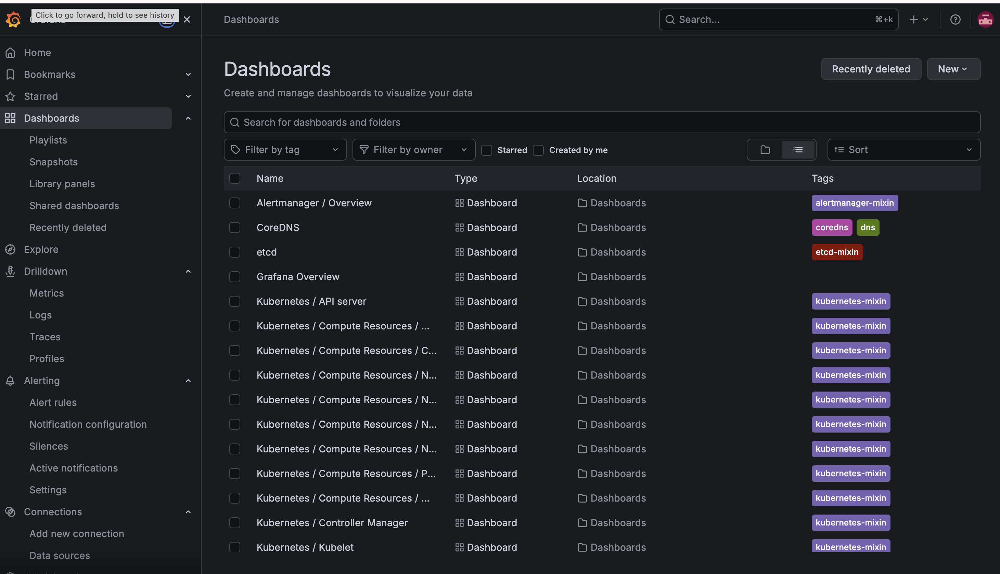
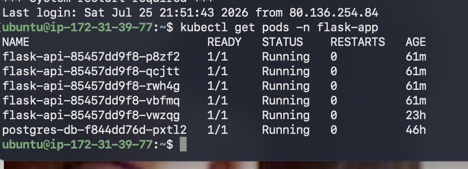
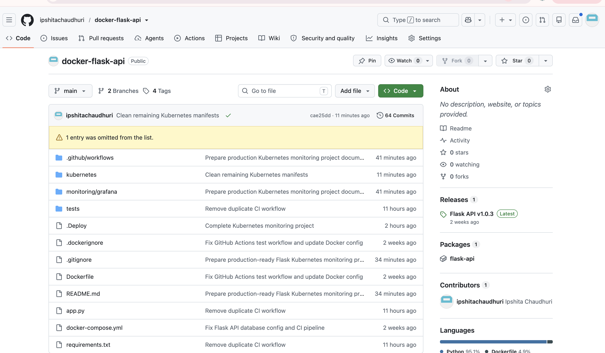
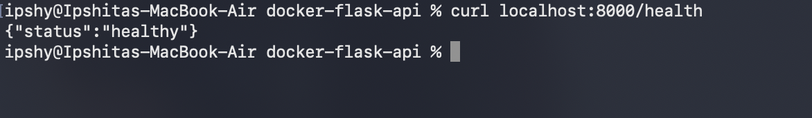

# 🚀 Production-Ready Flask API Deployment on Kubernetes with Prometheus, Grafana & AlertManager

A cloud-native Flask API platform deployed using Docker, Kubernetes, CI/CD automation, and monitoring tools.  
This project demonstrates production-style application deployment, scalability, observability, and DevOps practices.

---

# 🏗️ Architecture

```
Developer
    |
    v
GitHub Repository
    |
    v
GitHub Actions CI/CD
    |
    v
Docker Image (GHCR)
    |
    v
Kubernetes Cluster (AWS EC2)
    |
    +----------------+
    |                |
 Flask API       PostgreSQL
    |
    v
Prometheus Monitoring
    |
    v
Grafana Dashboard
    |
    v
AlertManager Notifications
```

---

# 🛠️ Technology Stack

- 🐍 Python Flask REST API
- 🐳 Docker & Docker Compose
- ☸️ Kubernetes
- 🔄 GitHub Actions CI/CD
- 📦 GitHub Container Registry (GHCR)
- 🐘 PostgreSQL Database
- ☁️ AWS EC2
- 🌐 NGINX Ingress Controller
- 🔐 TLS/HTTPS with cert-manager
- 📊 Prometheus
- 📈 Grafana
- 🚨 AlertManager
- 🐧 Linux

---

# 🚀 Features Implemented

✅ Containerized Flask API application using Docker

✅ Deployed Flask API and PostgreSQL workloads on Kubernetes

✅ Configured Kubernetes Deployments, Services, Namespaces, and Replicas

✅ Implemented CI/CD pipeline using GitHub Actions

✅ Built and published Docker images using GitHub Container Registry

✅ Added application health checks

✅ Integrated Prometheus monitoring

✅ Created Grafana dashboards for observability

✅ Configured AlertManager notifications

✅ Applied cloud-native deployment practices

---

# 📂 Project Structure

```
docker-flask-api/

├── app.py
├── Dockerfile
├── docker-compose.yml
├── requirements.txt

├── kubernetes/
│   └── k8s-export/
│       ├── flask-deployment.yaml
│       ├── flask-service.yaml
│       ├── postgres-deployment.yaml
│       ├── postgres-service.yaml
│       └── namespace.yaml

├── monitoring/
│   └── grafana/

├── screenshots/
│   ├── flask-health-check.png
│   ├── kubernetes-pods.png
│   ├── grafana-dashboard.png
│   └── github-actions.png

└── .github/
    └── workflows/
        ├── test.yml
        ├── docker-build.yml
        └── deploy.yml
```

---

# 🔄 CI/CD Pipeline

```
Code Push
    |
    v
GitHub Actions
    |
    v
Run Automated Tests
    |
    v
Build Docker Image
    |
    v
Push Image to GHCR
    |
    v
Deploy Application
```

---

# ☸️ Kubernetes Deployment

Implemented:

- Kubernetes Namespace configuration
- Flask API Deployment
- PostgreSQL Deployment
- Kubernetes Services
- Application replicas for availability
- Internal service communication

Example:

```bash
kubectl get pods -n flask-app
```

Application status:

```
NAME                         READY   STATUS
flask-api                    1/1     Running
postgres-db                 1/1     Running
```

---

# 📊 Monitoring & Observability

Monitoring stack:

- Prometheus → Metrics collection
- Grafana → Visualization dashboards
- AlertManager → Notifications

Implemented monitoring for:

✅ Application availability  
✅ Kubernetes workloads  
✅ Container metrics  
✅ API health status  

---

# 🧪 Flask Health Check

Endpoint:

```
GET /health
```

Response:

```json
{
  "status": "healthy"
}
```

---

# 📸 Project Screenshots

## Grafana Dashboard




## Kubernetes Pods




## GitHub Actions CI/CD




## Flask Health Check



---

# 🎯 Skills Demonstrated

- Cloud Native Application Deployment
- Kubernetes Administration
- Docker Containerization
- CI/CD Automation
- GitHub Actions
- AWS Cloud Infrastructure
- PostgreSQL Deployment
- Monitoring & Observability
- Linux Administration
- Python Backend Development

---

# 🔮 Future Improvements

- Deploy on Amazon EKS
- Add Terraform Infrastructure as Code
- Add AWS Load Balancer Controller
- Implement Horizontal Pod Autoscaling
- Add centralized logging with Loki
- Add CloudWatch integration

---

# 👩‍💻 Author

Ipshita Chaudhuri

Cloud & DevOps Engineer | AWS | Kubernetes | Docker | Terraform

GitHub:
https://github.com/ipshitachaudhuri


